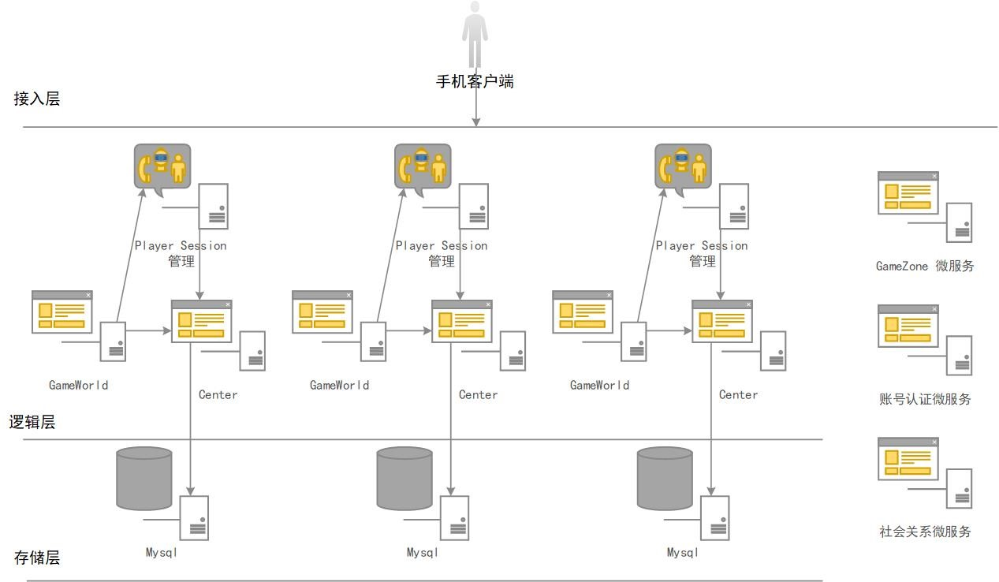

# 							白夜极光后台服务器压力测试方案

 

版本控制

| 版本 | 日期       | 作者    | 备注 |
| ---- | ---------- | ------- | ---- |
| V1.0 | 2021.04.25 | jeremyjfli |      |
|      |            |         |      |
|      |            |         |      |
|      |            |         |      |

 

 

 

 

 

### 1． 概述

#### 1.1 背景介绍

本次压测的目的是，检测我的长征游戏的核心业务系统的性能情况。保证业务在高并发的时候，系统也能稳定运行。因此希望完全模拟生产环境，模拟用户并发，对系统的核心业务进行压力测试，收集相关响应时间、以及对应系统的性能数据。并做为基线，对后续系统开发及优化提供参考。

#### 1.2 被测系统介绍

| **服务器名** | **是否单点** | **功能说明**                                                 |
| ------------ | ------------ | :----------------------------------------------------------- |
| Gameserver   | **单点**     | 游戏主逻辑服务器，包含三个进程，Game World, Game Center, Player Session, 压力主要集中在Game World进程上 |
| Gamezone     | 否           | 全局的微服务，idip回调接口等                                    |
| Auth         | 否           | 账号认证微服务，认证玩家账号进行账号授权，将账号和相应角色进行映射，同时客户端需要访问其他微服务时，也需要认证服务器的认证 |
| Social       | 否           | 社会关系微服务，目前只是管理好友信息                             |
| TenDB        | 集群         | 数据存储服务器，使用腾讯提供的db集群                            |
| Tendis       | 集群         | 使用腾讯提供的Redis 集群。                                     |

| 游戏分区模式   | 全区全服 |
| -------------- | -------- |
| 前后台通讯类型 | TCP+Protobuf |
| 连接类型       | 长连接   |

#### 1.3 压测环境

##### 1.3.1 机器配置

| 服务器名称                      | 操作系统 | CPU        | 内存 | 硬盘     | 网络带宽  |
| ------------------------------- | ------- | ---------- | ---- | -------- | -------- |
| GameServer服务器                | windows server | 1个 4核 | 16G   | 普通云盘 | 千兆    |
| 其他微服务服务器                 | linux    | 1个 4核 | 8G    | 普通云盘 | 千兆    |
| 施压机                          | linux    | 1个 24核   | 48GB |         |          |

##### 1.3.2 机器部署

总共5台机器：

3台用于部署GameServer

1台用于部署其他微服务模块（Gamezone,Authentication,Social）

1台用于施压

#### 1.4 压测框架

接入压测大师的上报API，开发商提供GAME API, 测试接入spr机器人框架，机器人数据上报压测大师.

#### 1.5 开发商预估

开发端预估单服在线人数5000-8000，实际按10000测

### 2. 压测场景

| 用户预估行为                      | 协议               | 1W  pcu的压力 |
| --------------------------------- | ------------------ | ------------- |
| 用户login（1.5分钟完成登录）      | login              | 100           |
| 用户每1分钟请求指示和执行指令12次  | UseCard            | 2000           |
| 用户每1分钟刷新请求指令30次        | DrawACard          | 5000            |
| 用户每1分钟6次继续行军            | HandleEvent        | 1000           |
| 用户每3分钟兑换2次                | GetToken           | 100           |
| 用户每1分钟答题6次                | AnswerTheQuestion+ClearCd         | 1000           |

### 3. 测试完成标准

##### 3.1 TDR3的标准

1. 针对服务器的技术规范要求，全部测试通过

2. 单服的综合场景测试下，必须满足性能基线（参考游戏容量建议表确定）要求，并且各事务 90% 响应时间 <1 秒，各事务成功率 >99.9%， CPU 消耗低于 80%

3. 稳定性测试运行 12 小时以上，切换不同批次账号，事务成功率 > 99.9%，无内存泄漏

4. 有条件的项目组建议搭建 50~100w PCU 的现网环境压测 7*24 小时，观察各节点压力、单机负载和事务情况

##### 3.2 关注的性能指标

- 并发数/TPS/响应时间/成功率

- CPU/内存/IO/网络

### 4.风险点

压力主要集中在Game World进程，其他暂无